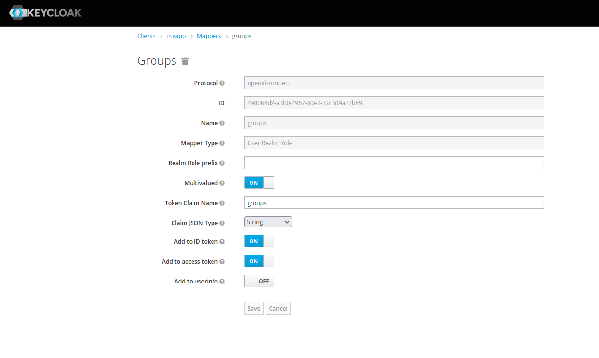

# How-To Integrate Apache and KeyCloud using mod_auth_openidc

This how-to describes how to integrate two simple Apache websites with KeyCloud using Apache module [mod_auth_openidc](https://github.com/zmartzone/mod_auth_openidc).

<!-- MarkdownTOC levels="2,3" autolink="true" -->

- [KeyCloud](#keycloud)
  - [Add realm](#add-realm)
  - [Add roles](#add-roles)
  - [Add user](#add-user)
  - [Create client](#create-client)
  - [Add client scope](#add-client-scope)
  - [Create protocol mapper](#create-protocol-mapper)
  - [Copy client secret](#copy-client-secret)
- [Apache2](#apache2)

<!-- /MarkdownTOC -->

## KeyCloud

### Add realm

Select **Add Realm**

|Property|Value   |
|--------|--------|
|Name    |`seetoo`|


### Add roles

Select **Group** → **New**

|Property|Value   |
|--------|--------|
|Name    |`myapp`|

### Add user

Select **Users** → **Add user**

|Property  |Value                 |
|----------|----------------------|
|Username  |`tony`                |
|Email     |`tonyclifton@seetoo.tech`|
|First Name|`Tony`                |
|Last Name |`Clifton`             |
|Groups    | **/myapp**           |

Via **Credentials** choose **Set password** and set a password for the user with **Temporary: OFF**

### Create client

**Clients** → **Create**

|Property       |Value                    |
|---------------|-------------------------|
|Client ID      |`myapp`                  |
|Client Protocol|**openid-connect**       |
|Root URL       |https://seetoo.tech/myapp|

Under tab **Settings**

|Property   |Value           |
|-----------|----------------|
|Access Type|**Confidential**|

In section **Authentication Flow Overrides**

|Property         |Value           |
|-----------------|----------------|
|Browser Flow     |**browser**     |
|Direct Grant Flow|**direct grant**|

Under tab **Mappers** add **Builtin**s

* given name
* email
* full name
* username
* groups
* realm roles

Select **groups**

Verify that username and group mappings are present in id and access token. This should be the case.

[](./files/mappers-groups.png)


### Add client scope

(Skipped)

### Create protocol mapper

Under tab **Mappers** select **Create**

|Property                |Value           |
|------------------------|----------------|
|Protocol                |openid-connect  |
|Name                    |`myapp-audience`|
|Mapper Type             |**Audience**    |
|Included Client Audience|**myapp**       |
|Add to ID token         |**OFF**         |
|Add to access token     |**ON**          |

### Copy client secret

Under **Credentials** of **myapp** client copy the secret for example

```
f847aa0a-308a-40b4-b03b-b398ec2228e8
```

Note: if tab **Credentials** is not visible, this means the **Access Type** is not **confidential**.

## Apache2

Configuration of Apache2 is done automatically in [ansible-dev](https://github.com/c2platform/ansible-dev)
 project. See for example [group_vars/reverse_proxy/main.yml](https://github.com/c2platform/ansible-dev/blob/master/group_vars/reverse_proxy/main.yml).

After enabling the [mod_auth_openidc](https://github.com/zmartzone/mod_auth_openidc) the Apache2 configuration that needs to be done is shown below

```
OIDCProviderMetadataURL https://seetoo.tech/auth/realms/seetoo/.well-known/openid-configuration
OIDCClientID myapp
OIDCClientSecret f847aa0a-308a-40b4-b03b-b398ec2228e8
OIDCRedirectURI https://{{ c2_apache_server_name }}/myapp/redirect_uri
OIDCCryptoPassphrase 4CEew/3zLkQMtw==
OIDCRemoteUserClaim email
OIDCScope "openid email"
OIDCPKCEMethod S256

<Location ~ "^/(myapp|myapp2)">
   AuthType openid-connect
   Require valid-user
</Location>
```

This configuration protects two Apache2 websites. One "local" on the reverse proxy itself via https://seetoo.tech/myapp/ and one via a `ProxyPass` directive https://seetoo.tech/myapp2/. 
